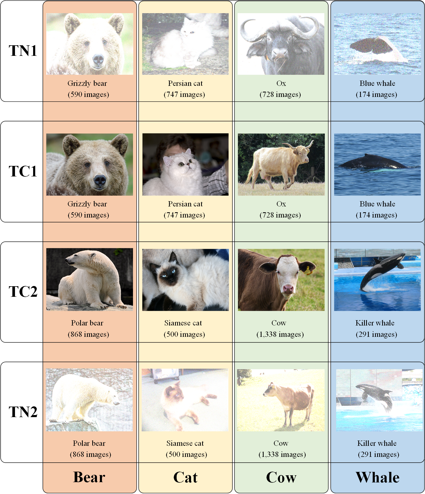

# Micro-CDA: Micro-Clustering Domain Adaptation

## Example usage

- Use ```addpath(genpath('./utils/'))``` to add the required auxiliary functions, after which you can use ``` Micro_CDA(Xs,Ys,Xt,Yt,options)```to call Micro-CDA wherever you need to.

- You can launch the program by executing "demo_Micro_CDA.m" in the root directory (in windows), or use the following command to run it in Linux (The output will be stored in "fill.out"). The codes will be run directly without errors.

```python
nohup matlab <demo_Micro_CDA.m> fill.out &
```

## Code files (matlab implementation)

├─demo_Micro_CDA.m: A demo that runs Micro-CDA on AWA2-DA.  
├─data  
│  ├─AWA2-DA: The `.mat` files of AWA2-DA (ResNet50) gained by using a ResNet50 extractor proposed in [1].    
│  └─				    Four classes are used in the paper.  
└─utils: The folder that stores `IMcro-CL`, `Micro-CDA` and some auxiliary functions.  
      └─liblinear-2.30: A libsvm tool.  

## High-resolution images in the manuscript

Figures 3 and 4 can be found in folder `./images/`, where Fig. 3 denotes the flowchart of the proposed Micro-CDA, and Fig. 4 presents the differences between KMM and the proposed IMicro-CL.


Fig. 3. The flowchart of the proposed Micro-CDA.


Fig. 4. A toy example that illustrates the problems of KMM.

## AWA2-DA

​	AWA2 [2] is a zero-shot learning dataset, where multiple-attributes are available during training. Following [3], we propose a comparable protocol for Domain Adaptation (DA) in the study. In the dataset, there are four sub-domains:

- **TC1**: A sub domain that contains the 2,239 images w.r.t "Grizzly bear", "Persian cat", "Ox", and "Blue whale". The images are collected  from AWA2.

- **TC2**: A sub domain that contains the 2,997 images w.r.t "Polar bear", "Siamese cat", "Cow", and "Killer whale". The images are collected from AWA2.

- **TN1**: A sub domain that contains the 2,239 images w.r.t "Grizzly bear", "Persian cat", "Ox", and "Blue whale". The images are formed by adding salts with 50% probability on "TC1".

- **TN2**: A sub domain that contains the 2,997 images w.r.t "Polar bear", "Siamese cat", "Cow", and "Killer whale". The images are formed by adding salts with 50% probability on "TC2".

  




[1] Q. Wang and T. Breckon, “Unsupervised Domain Adaptation via Structured Prediction Based Selective Pseudo-Labeling”, *AAAI*, vol. 34, no. 04, pp. 6243-6250, Apr. 2020.

[2] Y. Xian, C. H. Lampert, B. Schiele and Z. Akata. "Zero-shot learning—a comprehensive evaluation of the good, the bad and the ugly." *IEEE Trans. Pattern Anal. Mach. Intell.*, vol. 41, no. 9, pp. 2251-2265, 1 Sept. 2019.

[3] W. Zhang, L. Deng, L. Zhang and D. Wu, "A survey on negative transfer," in IEEE/CAA J. Automatica Sinica, doi: 10.1109/JAS.2022.106004.