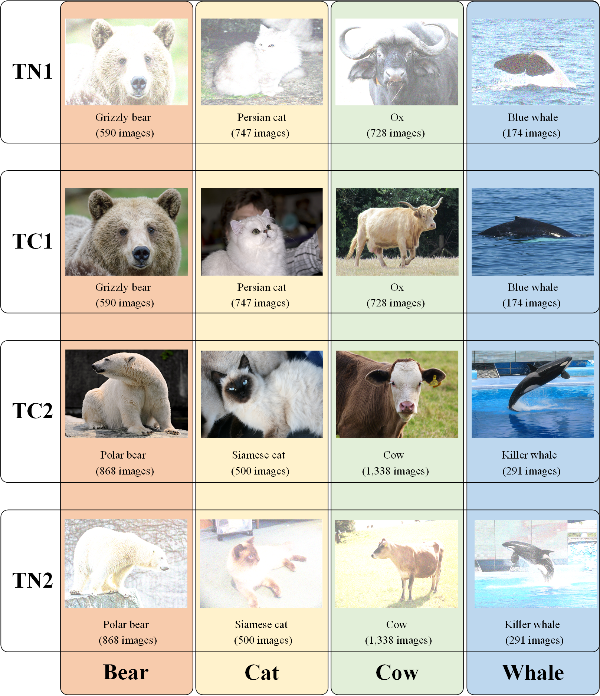

## AWA2-DA

​	AWA2 [1] is a zero-shot learning dataset, where multiple-attributes are available during training. Following [2], we propose a comparable protocol for Domain Adaptation (DA) in the study. In the dataset, there are four sub-domains:

- **TC1**: A sub domain that contains the 2,239 images w.r.t "Grizzly bear", "Persian cat", "Ox", and "Blue whale". The images are collected  from AWA2.

- **TC2**: A sub domain that contains the 2,997 images w.r.t "Polar bear", "Siamese cat", "Cow", and "Killer whale". The images are collected from AWA2.

- **TN1**: A sub domain that contains the 2,239 images w.r.t "Grizzly bear", "Persian cat", "Ox", and "Blue whale". The images are formed by adding salts with 50% probability on "TC1".

- **TN2**: A sub domain that contains the 2,997 images w.r.t "Polar bear", "Siamese cat", "Cow", and "Killer whale". The images are formed by adding salts with 50% probability on "TC2".

  

[1] Y. Xian, C. H. Lampert, B. Schiele and Z. Akata. "Zero-shot learning—a comprehensive evaluation of the good, the bad and the ugly." *IEEE Trans. Pattern Anal. Mach. Intell.*, vol. 41, no. 9, pp. 2251-2265, 1 Sept. 2019.

[2] W. Zhang, L. Deng, L. Zhang and D. Wu, "A survey on negative transfer," in IEEE/CAA J. Automatica Sinica, doi: 10.1109/JAS.2022.106004.

